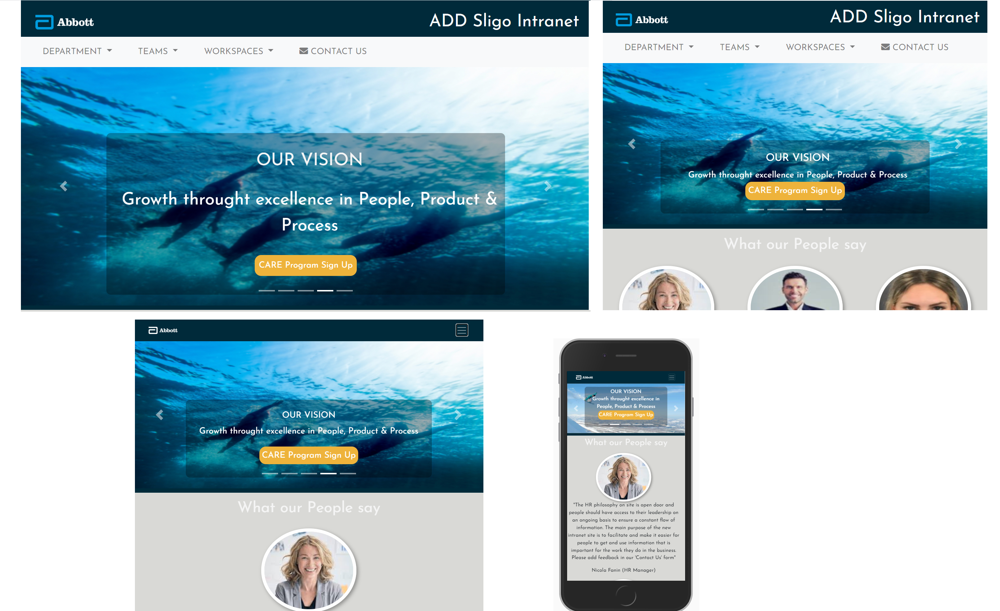

<h1 align="center">ADD, Sligo Intranet</h1>

[View the live project here.]( https://bridcourtney.github.io/project-1-employee-site-hub/)

The ADD, Sligo Employee Intranet, will give Visitors immediate access to our internal business.  The concept of the Intranet is to advance and build awareness of the business to which we all contribute to. 

The site will be hosted on SharePoint.  Each Department will have a page.  Department Page design will be streamlined and always carry the site header, footer and navigation Bar for consistency.  

Business Teams will have the opportunity to host their SharePoint document Libraries & lists e.g the 'IDEA' & 'Good Catch' initiatives. The EHS, Risk Management and many more teams can share information and updates.  The Workspace dropdown will contain links to common applications, websites etc.  The 'Contact Us' link will provide users an opportunity to provide feedback and suggestions.

The Sign Up button in the Site Vision area currently links to Our CARE Program, next month there will be a new promotion.  Once the User clicks on the submit button the SharePoint list for the particular promotion will be updated with the persons email. 

It is designed to be responsive and accessible on a range of devices, making it easy to navigate for employees.

<h2 align="center"></h2>

## User Experience (UX)

-   ### User stories

    -   #### New Visitor Goals

        1. As a New Visitor, I want all my commonly used app links in one place a ‘Hub’, so much time will be saved
        2. As a New Visitor, I want to easily understand the main purpose of the site and learn more about the organisation.
        3. As a New Visitor, I want to be able to easily navigate throughout the site to find content.

    -   #### Returning Visitor Goals

        1. As a Returning Visitor, I want to update Teams files. Add that great Idea I have to the IDEA form, and maybe win some Time in            Lieu for my effort 
        2.  As a Returning Visitor, I want to Sign Up to the latest HR Inititive e.g. CARE Program, Heart Foundation Presentation Sign              Up etc
        
        

    -   #### Frequent User Goals
        1. As a Frequent User, I want to check my Team files for new assignments and required approvals.
        2. As a Frequent User, I want to check the EHS Page for Latest Covid 19 updates.
        3. As a Frequent User, I want to submit Suggestion from the 'Contact Us' page
        
     
    -   #### Intranet Owner Goals
        1. As the Site Owner, I want to provide Employees with 'A Hub' to share information. 
        2. As the Site Owner, I want the Site Vision and the Site Behavior displayed.  Also, information about the site 
       

-   ### Design
    -   #### Colour Scheme
        -   Color is fundamental in the way we express the Abbott brand. The color palette I used includes, Dark Blue in the                           header and footer of each page.  I used Light Grey as a Neutral Colour in the 'What Our People say' section.  In the                     'Our Site' section I included Gold to give the Site energy.  I also used Gold for the 'CARE Program' button on the main                 Page for a splash of colour.
            The Site Background colour is White, it acts like a blank stage that draws attention to the Site Content.  The vibrant                      color Gold, the imagery used and typography really ‘pop’ out against a white background.

    -   #### Typography.
        -   The 'Josefin Sans' font is the main font used throughout the whole website with sans-serif as the fallback font in case for             any reason the font isn't being imported into the site correctly. The 'Josefin Sans'gives the Site an unified appearance                    throughtout 
    -   #### Imagery
        -   I selected imagery that was not posed or contrived. No images that are treated or stylized.  My images share a common thread                of humanity, greatness and authenticity. Images that depict- 
           - ###### People living in the moment (person snowboarding on Montain Top, Girl Free Floating in water 'Contact Us' page).
           - ###### People engaged in an activity (Cyclying Team).
           - ###### Concepts that go beyond what is actually depicted (View blue sky through white Pergola).
           - ###### Engaging scenery that entices the viewer (Satellite view of river delta).

*   ### Wireframes

    -   Home Page Wireframe - [View](wireframes/Home_Page.pdf)

    -   Mobile Wireframe - [View](wireframes/Mobile.pdf)

    -   Contact Us Page Wireframe - [View](wireframes/Contact_Us.pdf)

## Features

-   Responsive on all device sizes

-   Interactive elements

## Technologies Used

### Languages Used

-   [HTML5](https://en.wikipedia.org/wiki/HTML5)
-   [CSS3](https://en.wikipedia.org/wiki/Cascading_Style_Sheets)
-   Small piece of Java Script for Validation of 'Submit' Comment on the 'Contact Us' page.  If the user does not enter their Email         address and they hit the 'Submit' button, they will get a message to fill in the Email field.  Once they fill in the Email field and        hit the 'Submit' button, User will receive a confirmation message.

### Frameworks, Libraries & Programs Used

1. [Bootstrap 4.4.1:](https://getbootstrap.com/docs/4.4/getting-started/introduction/)
    - Bootstrap was used to assist with the responsiveness and styling of the website.
2. [Hover.css:](https://ianlunn.github.io/Hover/)
    - Hover.css was used on the Social Media icons in the footer to add the float transition while being hovered over.
3. [Google Fonts:](https://fonts.google.com/)
    - Google fonts were used to import the 'Titillium Web' font into the style.css file which is used on all pages throughout the project.
4. [Font Awesome:](https://fontawesome.com/)
    - Font Awesome was used on all pages throughout the website to add icons for aesthetic and UX purposes.
5. [jQuery:](https://jquery.com/)
    - jQuery came with Bootstrap to make the navbar responsive but was also used for the smooth scroll function in JavaScript.
6. [Git](https://git-scm.com/)
    - Git was used for version control by utilizing the Gitpod terminal to commit to Git and Push to GitHub.
7. [GitHub:](https://github.com/)
    - GitHub is used to store the projects code after being pushed from Git.
8. [GIMP:](https://developer.gimp.org/)
    - GIMP was used resizing images and editing photos for the website.
9. [Balsamiq:](https://balsamiq.com/)
    - Balsamiq was used to create the [wireframes](https://github.com/) during the design process.
10. Microsoft Paint
    - Paint was used to create the image about displaying the responsiveness of the Site 

## Testing

The W3C Markup Validator and W3C CSS Validator Services were used to validate every page of the project to ensure there were no syntax errors in the project.

-   [W3C Markup Validator](https://jigsaw.w3.org/css-validator/#validate_by_input) - [Results for Contact.html](Validation/Contact-Us-HTML_Validator.JPG)
-   [W3C Markup Validator](https://jigsaw.w3.org/css-validator/#validate_by_input) - [Results for Index.html](Validation/Index-HTML_Validator.JPGValidation/Contact-Us-HTML_Validator.JPG)
-   [W3C CSS Validator](https://jigsaw.w3.org/css-validator/#validate_by_input) - [Results for Style.css](Validation/StyleCSS-Validator.JPG)

### Testing User Stories from User Experience (UX) Section

-   #### First Time Visitor Goals

    1. As a New Visitor, I want all my commonly used app links in one place a ‘Hub’, so much time will be saved

         1. Upon entering the site, users are automatically greeted with a clean and easily readable navigation bar to go to the page            of their choice.  In this case the user is looking for the Workspace Dropdwon that contains a list of commonly used apps &             websites

    2. As a New Visitor, I want to easily understand the main purpose of the site and learn more about the organisation.

        1. The site contains the workplace Vision and Behaviours.  The 'Our Site' section give New visitor an overview of their new                   workplace

    3. As a New Visitor, I want to be able to easily navigate throughout the site to find content.
        1. Upon entering the site, users are automatically greeted with a clean and easily readable navigation bar to go to the page            of their choice. Each page in the site will have an uniform header, footer and Navigation Bar that will intutively bring the User          where they wan to go

-   #### Returning Visitor Goals

    1. As a Returning Visitor, I want to update Teams files. Add that great Idea I have to the IDEA form, and maybe win some Time in            Lieu for my effort 

        1. All Team can be easily found under the Team dropdown
      

    2. As a Returning Visitor, I want to Sign Up to the latest HR Inititive e.g. CARE Program, Heart Foundation Presentation etc

        1. Sign Up to various Initiatives will be available on the Home Page in the Our Vision section

.

-   #### Frequent User Goals

    1. As a Frequent User, I want to check the EHS Page for Latest Covid 19 updates.

        1. The EHS Page will be available from the Navigation Bar with all the latest updates

    2. As a Frequent User, I want to submit Suggestion from the 'Contact Us' page

        1. Link to the Contact Us page is available from the Home Page, User can easily navigate bach to HomePage on completion

    3. As a Frequent User, I want to check my Team files for new assignments and required approvals.
    
        1. Historically file e.g. excel etc were located on shared drives and updated by Team.  In Office 365 file sharing is not                   meeting Customer Satisfaction and has led to data loss.  Therefore SharePoint Document list and Library Webparts offers                 Teams a Safer more reliable altenative
        

     
### Further Testing

-   The Website was tested on Google Chrome, Internet Explorer & Microsoft Edge.
-   The website was viewed on a variety of devices such as Desktop, Laptop, iPhone7, iPhone 8 & iPhoneX.
-   A large amount of testing was done to ensure that all pages were linking correctly.
-   Friends and family members were asked to review the site and documentation to point out any bugs and/or user experience issues.

### Known Bugs

-   On small mobile devices the vision container touches the top of the Navigation Bar.
-   In the Behaviours container I wanted to concatenate the Behaviour with the icon, I did not have time to complete this requirement.        Therefore on some screens the Behaviour may not have the icon beside it, because it is on the line above

## Deployment

### GitHub Pages

The project was deployed to GitHub Pages using the following steps...

1. Log in to GitHub and locate the [GitHub Repository](https://github.com/)
2. At the top of the Repository (not top of page), locate the "Settings" Button on the menu.
    - Alternatively Click [Here](https://raw.githubusercontent.com/) for a GIF demonstrating the process starting from Step 2.
3. Scroll down the Settings page until you locate the "GitHub Pages" Section.
4. Under "Source", click the dropdown called "None" and select "Master Branch".
5. The page will automatically refresh.
6. Scroll back down through the page to locate the now published site [link](https://github.com) in the "GitHub Pages" section.

### Forking the GitHub Repository

By forking the GitHub Repository we make a copy of the original repository on our GitHub account to view and/or make changes without affecting the original repository by using the following steps...

1. Log in to GitHub and locate the [GitHub Repository](https://github.com/)
2. At the top of the Repository (not top of page) just above the "Settings" Button on the menu, locate the "Fork" Button.
3. You should now have a copy of the original repository in your GitHub account.

### Making a Local Clone

1. Log in to GitHub and locate the [GitHub Repository](https://github.com/)
2. Under the repository name, click "Clone or download".
3. To clone the repository using HTTPS, under "Clone with HTTPS", copy the link.
4. Open Git Bash
5. Change the current working directory to the location where you want the cloned directory to be made.
6. Type `git clone`, and then paste the URL you copied in Step 3.

```
$ git clone https://github.com/YOUR-USERNAME/YOUR-REPOSITORY
```

7. Press Enter. Your local clone will be created.

```
$ git clone https://github.com/YOUR-USERNAME/YOUR-REPOSITORY
> Cloning into `CI-Clone`...
> remote: Counting objects: 10, done.
> remote: Compressing objects: 100% (8/8), done.
> remove: Total 10 (delta 1), reused 10 (delta 1)
> Unpacking objects: 100% (10/10), done.
```

Click [Here](https://help.github.com/en/github/creating-cloning-and-archiving-repositories/cloning-a-repository#cloning-a-repository-to-github-desktop) to retrieve pictures for some of the buttons and more detailed explanations of the above process.

## Credits

### Code

-   [Bootstrap4](https://getbootstrap.com/docs/4.4/getting-started/introduction/): Bootstrap Library used throughout the project mainly     to make site responsive using the Bootstrap Grid System.

-   The Navbar code was taken from https://www.w3schools.com/bootstrap4/bootstrap_navbar.asp, and taylored to meet my requirements
-   The Carousal code was taken from https://www.w3schools.com/bootstrap4/bootstrap_carousel.asp, I added Captions to Slides and               taylored to meet my requirements 
-   I got idea for the rounded images and from the Code Institute page 'What our Graduates say' section, I wrote the code myself and            copied the css for images from the 'Whiskey Drop' tutorial
-  I copied code for the Modal Form from the Whiskey Drop lesson
-  I copied the script for the submit Alert on the CARE Program form https://www.codecademy.com/forum_questions/512d28a06918338f2300e9ea
-  I got $("#exampleInputEmail1").val(); from https://stackoverflow.com/questions/46155/how-to-validate-an-email-address-in-javascript,     then I was able to check if the email field was blank
-  In the Contact Us page I copied the Form element & associated CSS from 'Love Running' tutorial, and taylored to meet my requirements

### Content

-   All content was written by the developer.


### Media

-   All the Carousal Images, Contact Us Background and the Abbott logo's were downloaded from the Abbott Branding SharePoint site
 
### Acknowledgements

-   My Mentor for continuous helpful feedback.

-   Tutor support at Code Institute for their support.
